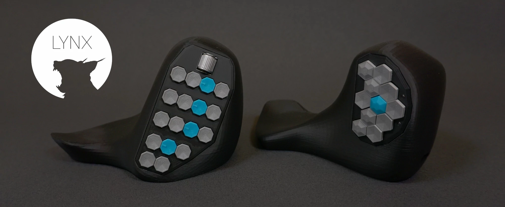
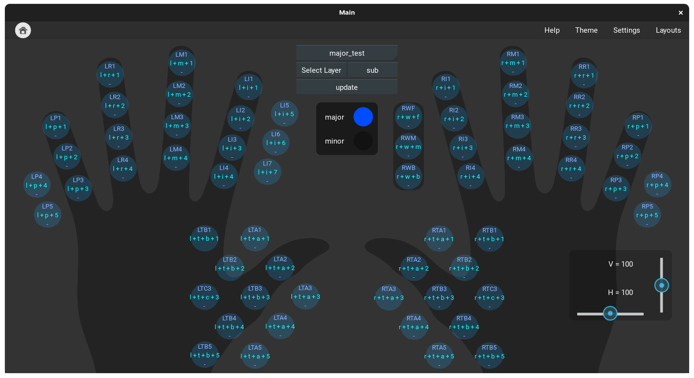

# LYNXsetup (the cats)

The cat is a computer input device with different modules. Together with the software it's a versatile and flexible system that accommodates the individual needs of any user. LYNX aims to create equipment that enhances the workflow by reducing unnecessary movements. 

The complete project documentation is at: https://www.lynxware.org/

# LYNXapp

This software is for key assignment and layout creation for the LYNXsetup

## Prerequisites

Before running this application, make sure you have the following packages installed:

- Python (version 3.10)
- pySerial (version 3.5)
- Kivy (version 2.1.0)
- plyer (version 2.1.0)
- PyAutoGUI (version 0.9.53)

